# Карта «Цифровой Казахстан»: центры, хабы, проекты и связи

Ниже — структурная карта по материалам из вашего описания.

```mermaid
graph TD
    %% ---------- Core state platform ----------
    GaaP["Стратегия: Государство как платформа"]
    MDDIA["Минцифры (МЦРИАП)"]
    Bagdat["Политическое лидерство\n(курс Багдата Мусина)"]
    eGov["eGov / eGov Mobile"]
    MobileDocs["Цифровые документы\n(удостоверение, права)"]
    Citizens["Граждане (город + село)"]

    GaaP --> MDDIA
    MDDIA --> eGov
    Bagdat --> GaaP
    eGov --> MobileDocs
    MobileDocs --> Citizens

    %% ---------- Public-private integration ----------
    Kaspi["Kaspi superapp"]
    GovServices["Госуслуги в банковском приложении\n(справки, переоформление авто)"]
    QR["QR-платежи как повседневный стандарт"]

    eGov --> GovServices
    Kaspi --> GovServices
    GovServices --> Citizens
    Kaspi --> QR
    QR --> Citizens

    %% ---------- Innovation and tax regime ----------
    AstanaHub["Astana Hub"]
    Expo["Инфраструктура EXPO"]
    Tax0["Налоговые льготы 5 лет\n(КПН/НДС/ИПН = 0)"]
    Startups["Стартапы Казахстана"]
    Reinvest["Реинвестирование в продукт"]

    Expo --> AstanaHub
    Tax0 --> AstanaHub
    AstanaHub --> Startups
    Startups --> Reinvest

    %% ---------- Talent inflow after 2022 ----------
    Relocation["Приток специалистов после 2022\n(RU/BY/UA)"]
    Competence["Импорт компетенций и опыта"]
    LocalMarket["Усиление локального IT-рынка"]

    Relocation --> AstanaHub
    Relocation --> Competence
    Competence --> LocalMarket
    LocalMarket --> Startups

    %% ---------- Education and mindset ----------
    Mindset["Сдвиг престижа: нефть → код"]
    nFactorial["nFactorial"]
    NU["Назарбаев Университет"]
    Eng["Английский + международные стандарты разработки"]
    Youth["Новое поколение разработчиков"]

    Mindset --> Youth
    nFactorial --> Youth
    NU --> Youth
    Eng --> Youth
    Youth --> Startups

    %% ---------- Bottlenecks / risks ----------
    Risks["Критические узкие места"]
    InternetShutdown["Отключение интернета (январь 2022)"]
    Fragility["Риск цифровой хрупкости / репутации"]
    Coverage["Огромная территория + низкая плотность населения"]
    BBD["Сложность покрытия ШПД"]
    Starlink["Регуляторные барьеры для Starlink"]
    VCgap["Дефицит частного венчура"]
    QVC["Qazaqstan VC\n(госкапитал с условиями)"]
    Outflow["Уход стартапов за раундами\n(Дубай/Сингапур)"]

    Risks --> InternetShutdown
    InternetShutdown --> Fragility
    Risks --> Coverage
    Coverage --> BBD
    Starlink --> BBD
    Risks --> VCgap
    QVC --> VCgap
    VCgap --> Outflow
    Outflow --> Startups

    %% ---------- Geopolitics and competition ----------
    Competition["Геополитическая конкуренция"]
    Uzbekistan["Узбекистан\n(демография + реформы)"]
    KZlead["Лидерство Казахстана в регионе"]
    AIFC["МФЦА / AIFC"]
    EngLaw["Английское право\n'юридический остров'"]
    WestInv["Понятный контур для западных инвесторов"]

    Competition --> Uzbekistan
    Uzbekistan --> KZlead
    AIFC --> KZlead
    AIFC --> EngLaw
    EngLaw --> WestInv
    WestInv --> Startups

    %% ---------- Interlocks ----------
    GaaP --> AstanaHub
    AstanaHub --> AIFC
    Fragility -. сдерживает .-> WestInv
    BBD -. ограничивает .-> Citizens
```

## Короткая легенда
- **Синие драйверы**: eGov, Kaspi-интеграция, Astana Hub, образовательные проекты.
- **Оранжевые риски**: отключения связи, разрыв покрытия, дефицит частного VC.
- **Зелёные усилители конкурентоспособности**: AIFC, приток талантов, англоязычная инженерная школа.

## Мини-матрица связей (кто на что влияет)

| Узел | Прямое влияние на |
|---|---|
| Государство как платформа | eGov, цифровые документы, интеграцию с частным сектором |
| Kaspi + госуслуги | Массовое использование цифровых сервисов населением |
| Astana Hub | Рост стартапов, удержание/приток специалистов |
| nFactorial + NU | Подготовка инженерных кадров |
| AIFC | Привлечение международного капитала |
| Интернет-ограничения / слабый ШПД | Снижение доверия инвесторов и доступности сервисов |
| Недостаток частного VC | Миграция стартапов за крупными раундами |

